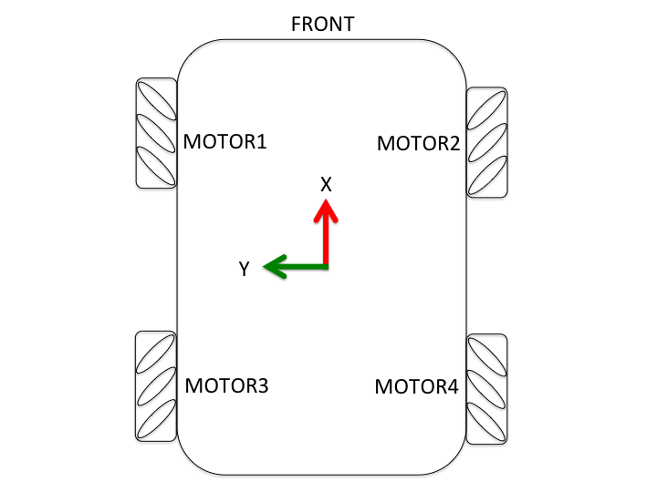
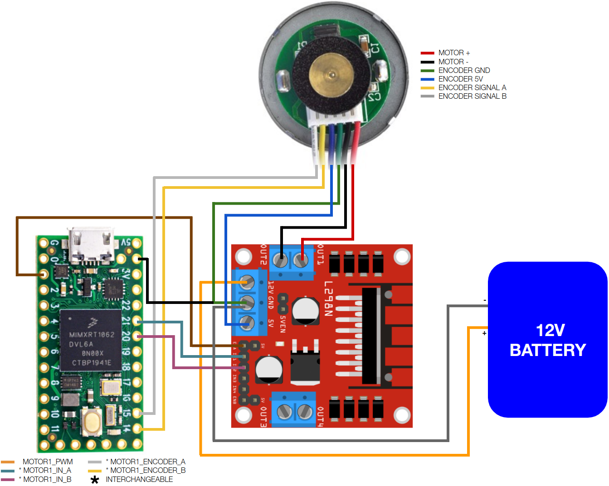
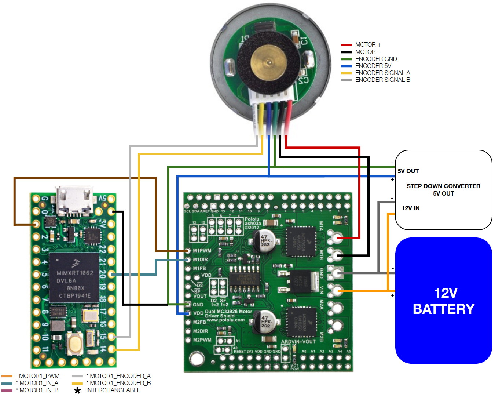
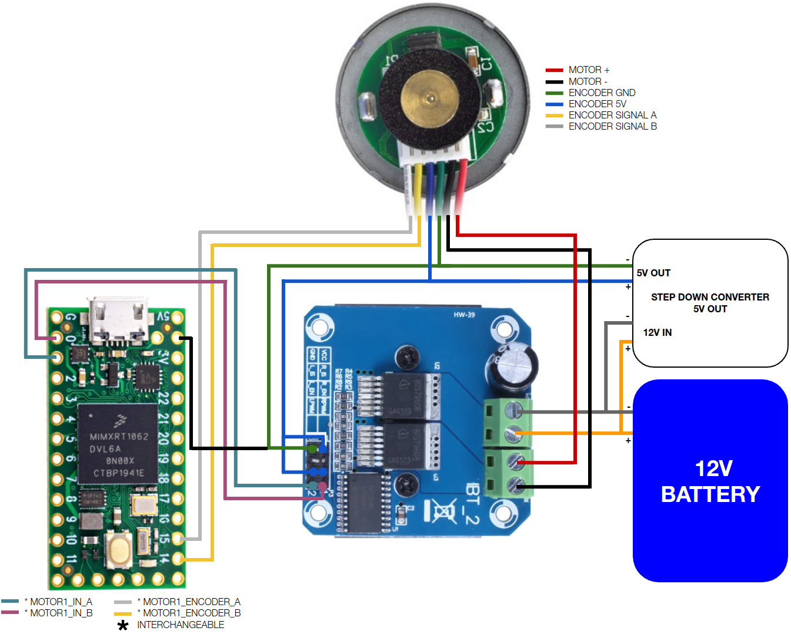
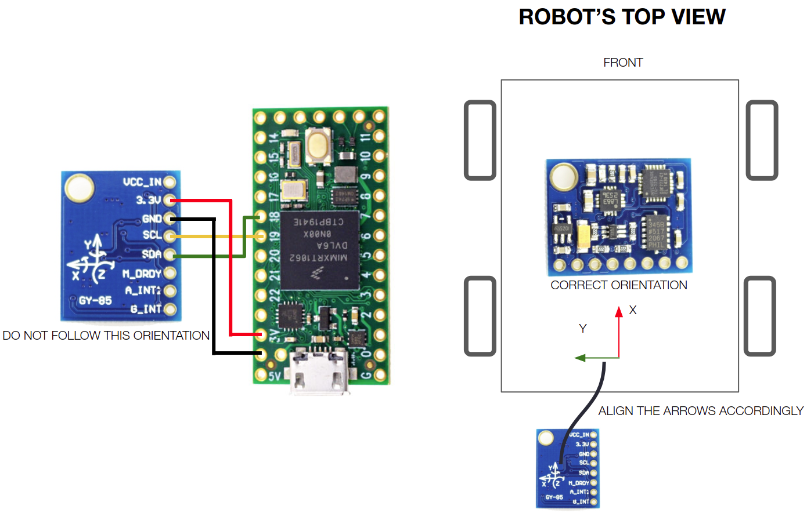
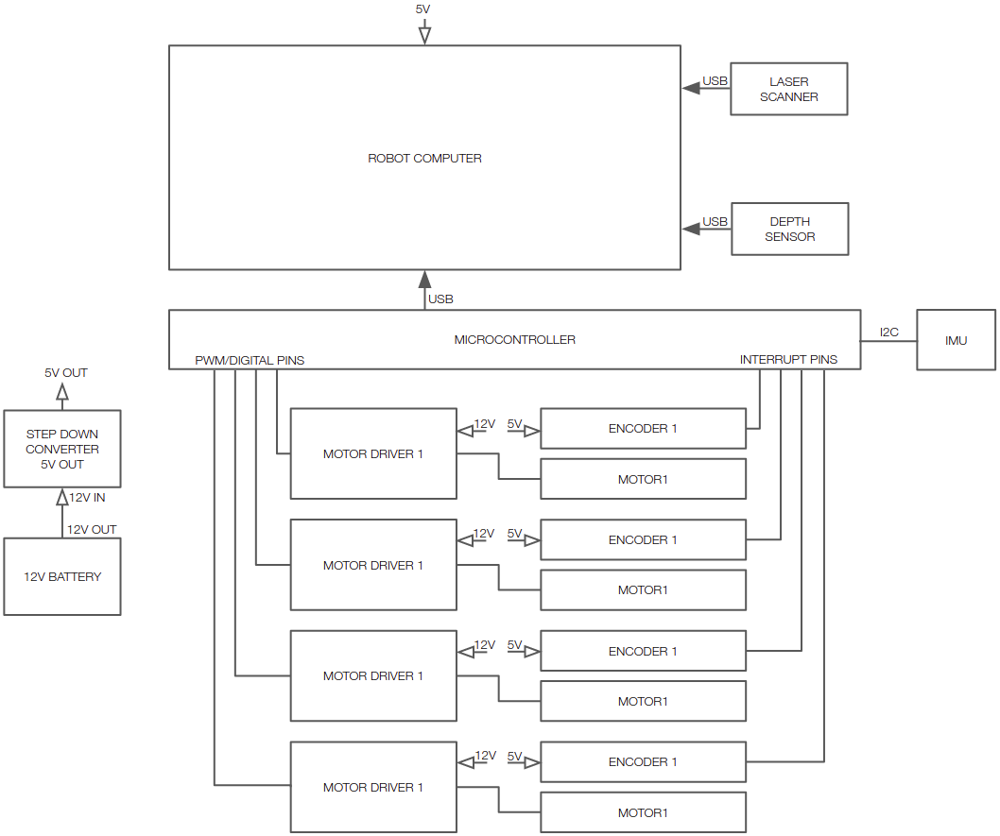
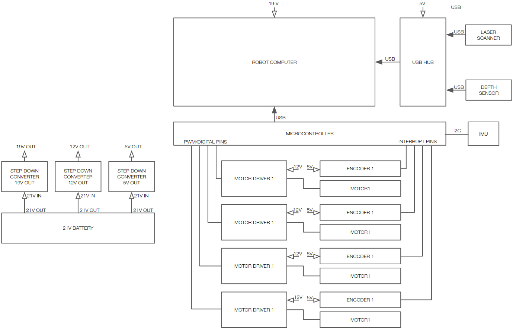

# Mecanum-Robot-Navigation
Mecanum Robot Navigation

### 1. UBUNTO Installation
Download and install Ubuntu for Raspberry pi & PC https://ubuntu.com/download/desktop

### 2. ROS2 and linorobot2 installation
It is assumed that you already have ROS2 and linorobot2 package installed. If you haven't, go to [linorobot2](https://github.com/linorobot/linorobot2) package for installation guide.

### 3. Install PlatformIO
Download and install platformio. [Platformio](https://platformio.org/) allows you to develop, configure, and upload the firmware without the Arduino IDE. This means that you can upload the firmware remotely which is ideal on headless setup especially when all components have already been fixed. 
    
    python3 -c "$(curl -fsSL https://raw.githubusercontent.com/platformio/platformio/master/scripts/get-platformio.py)"

Add platformio to your $PATH:

    echo "PATH=\"\$PATH:\$HOME/.platformio/penv/bin\"" >> $HOME/.bashrc
    source $HOME/.bashrc


### 4. Setup for .bashrc Ubuntu

    cd 
    nano .bashrc
    
source ws

    # === Linorobot2 ROS 2 Jazzy Setup ===
    
    source /opt/ros/jazzy/setup.bash
    source ~/Robot_Control_ws/install/setup.bash
    source ~/microros_ws/install/setup.bash
    source ~/rplidar_a1_ws/install/setup.bash
    
connect ros robot to pc master

    export ROS_MASTER_URI=http://10.182.81.183:11311
    export ROS_IP=10.182.81.183:11311
    
Custom BASE Type

    export LINOROBOT2_BASE=mecanum
    
Custom Lidar 

    export LINOROBOT2_LASER_SENSOR=a1
    

Setup Platformio 

    PATH="$PATH:$HOME/.platformio/penv/bin"

### 5. UDEV Rule
Download the udev rules from Teensy's website:

    wget https://www.pjrc.com/teensy/00-teensy.rules

and copy the file to /etc/udev/rules.d :

    sudo cp 00-teensy.rules /etc/udev/rules.d/


## Building the robot

### 1. Robot orientation
Robot Orientation:

-------------FRONT-------------

WHEEL1 WHEEL2 (2WD)

WHEEL3 WHEEL4 (4WD/Mecanum)

--------------BACK--------------



### 2. Motor Drivers

Supported Motor Drivers:

- **GENERIC_2_IN_MOTOR_DRIVER** - Motor drivers that have EN (pwm) pin, and 2 direction pins (usually DIRA, DIRB pins). Example: L298 Breakout boards.

- **GENERIC_1_IN_MOTOR_DRIVER** - Motor drivers that have EN (pwm) pin, and 1 direction pin (usual DIR pin). These drivers usually have logic gates included to lessen the pins required in controlling the driver. Example: Pololu MC33926 Motor Driver Shield.

- **BTS7960_MOTOR_DRIVER** - BTS7960 motor driver.

- **ESC_MOTOR_DRIVER** - Bi-directional (forward/reverse) electronic speed controllers.

The motor drivers are configurable from the config file explained in the later part of this document.

### 3. Inertial Measurement Unit (IMU)

Supported IMUs:

- **GY-85**
- **MPU6050**
- **MPU9150**
- **MPU9250**
- **BNO055**

Supported MAGs:

- **HMC5883L**
- **AK8963**
- **AK8975**
- **AK09918**
- **QMC5883L**

### 4. Connection Diagram
Below are connection diagrams you can follow for each supported motor driver and IMU. For simplicity, only one motor connection is provided but the same diagram can be used to connect the rest of the motors. You are free to decide which microcontroller pin to use just ensure that the following are met:

- Reserve SCL0 and SDA0 (pins 18 and 19 on Teensy boards) for IMU.

- When connecting the motor driver's EN/PWM pin, ensure that the microcontroller pin used is PWM enabled. You can check out PJRC's [pinout page](https://www.pjrc.com/teensy/pinout.html) for more info.

Alternatively, you can also use the pre-defined pin assignments in lino_base_config.h. Teensy 3.x and 4.x have different mapping of PWM pins, read the notes beside each pin assignment in [lino_base_config.h](https://github.com/linorobot/linorobot2_hardware/blob/master/config/lino_base_config.h#L112) carefully to avoid connecting your driver's PWM pin to a non PWM pin on Teensy. 

All diagrams below are based on Teensy 4.0 microcontroller and GY85 IMU. Click the images for higher resolution.

#### 4.1 GENERIC 2 IN



#### 4.2 GENERIC 1 IN



#### 4.3 BTS7960



#### 4.4 IMU



Take note of the IMU's correct orientation when mounted on the robot. Ensure that the IMU's axes are facing the correct direction:

- **X** - Front
- **Y** - Left
- **Z** - Up

#### 4.5 System Diagram
Reference designs you can follow in building your robot.

A minimal setup with a 5V powered robot computer.


A more advanced setup with a 19V powered computer and USB hub connected to sensors.


For bigger robots, you can add an emergency switch in between the motor drivers' power supply and motor drivers.

## Setting up the firmware

platformio.ini
```
[env:myrobot]
platform = espressif32
board = esp32dev
framework = arduino
;board_build.mcu = esp32
board_build.f_flash = 80000000L
board_build.flash_mode = qio
upload_port = /dev/ttyUSB0
upload_protocol = esptool
board_microros_distro = humble
board_microros_transport = serial
monitor_speed = 115200
monitor_port = /dev/ttyUSB0
monitor_dtr = 0
monitor_rts = 0
lib_deps =
    ${env.lib_deps}
	madhephaestus/ESP32Servo@^0.13.0
	madhephaestus/ESP32Encoder @ ^0.10.1
	adafruit/Adafruit Unified Sensor@^1.1.14
	adafruit/Adafruit BusIO@^1.16.1
	adafruit/Adafruit BNO055@^1.6.3
	sparkfun/SparkFun u-blox GNSS Arduino Library@^2.2.27
	thingpulse/ESP8266 and ESP32 OLED driver for SSD1306 displays@^4.6.1
build_flags =
    -I ~/.platformio/packages/framework-arduinoespressif32/libraries/SPI/src
    -I ../config
    -D USE_MYROBOT_CONFIG
```

../config/config.h
```
#ifdef USE_DEV_CONFIG
    #include "custom/dev_config.h"
#endif

// Add myrobot here
#ifdef USE_MYROBOT_CONFIG
    #include "custom/myrobot_config.h"
#endif

// this should be the last one
#ifndef LINO_BASE
    #include "lino_base_config.h"
#endif
```

../config/custom/myrobot_config.h
```
#ifndef MYROBOT_CONFIG_H
#define MYROBOT_CONFIG_H

#define LED_PIN 2 //used for debugging status
...
...
#endif
```


### 1. Robot Settings
Open your custom configuration file. Uncomment the base, motor driver and IMU you want to use for your robot. For example:

    #define LINO_BASE MECANUM 
    #define USE_BTS7960_MOTOR_DRIVER 
    #define USE_BNO055_IMU
    //#define USE_MPU6050_IMU

Constants' Meaning:

*ROBOT TYPE (LINO_BASE)*
- **DIFFERENTIAL_DRIVE** - 2 wheel drive or tracked robots w/ 2 motors.

- **SKID_STEER** - 4 wheel drive robots.

- **MECANUM** - 4 wheel drive robots using mecanum wheels.

*MOTOR DRIVERS*
- **USE_GENERIC_2_IN_MOTOR_DRIVER** - Motor drivers that have EN (pwm) pin, and 2 direction pins (usually DIRA, DIRB pins).

- **USE_GENERIC_1_IN_MOTOR_DRIVER** - Motor drivers that have EN (pwm) pin, and 1 direction pin (usual DIR pin). These drivers usually have logic gates included to lessen the pins required in controlling the driver.

- **USE_BTS7960_MOTOR_DRIVER** - BTS7960 motor driver.

- **USE_ESC_MOTOR_DRIVER** - Bi-directional (forward/reverse) electronic speed controllers.

*INERTIAL MEASUREMENT UNIT (IMU)*
- **USE_GY85_IMU** - GY-85 IMUs.

- **USE_MPU6050_IMU** - MPU6060 IMUs.

- **USE_MPU9150_IMU** - MPU9150 IMUs.

- **USE_MPU9250_IMU** - MPU9250 IMUs.
  
- **USE_BNO055_IMU** - BNO055 IMUs.

- **USE_HMC5883L_IMU** - HMC5883L MAGs.

- **USE_AK8963_MAG** - AK8963 MAGs.

- **USE_AK8975_MAG** - AK8975 MAGs.

- **USE_AK09918_MAG** - AK09918 MAGs.

- **USE_QMC5883L_MAG** - QMC5883L MAGs.

- **MAG_BIAS** - Magnetometer calibration, eg { -352, -382, -10 }.

Next, fill in the robot settings accordingly:

	#define K_P 0.20      //0.15                      
	#define K_I 0.20       //0.15                      
	#define K_D 0.20       //0.15                     
	/*
	ROBOT ORIENTATION
	         FRONT
	    MOTOR1  MOTOR2  (2WD/ACKERMANN)
	    MOTOR3  MOTOR4  (4WD/MECANUM)
	         BACK
	*/
	#define MOTOR_MAX_RPM 120       
	#define MAX_RPM_RATIO 0.8
	#define MOTOR_OPERATING_VOLTAGE 12
	#define MOTOR_POWER_MAX_VOLTAGE 12
	#define MOTOR_POWER_MEASURED_VOLTAGE 12   
	
	#define COUNTS_PER_REV1 1125 //960
	#define COUNTS_PER_REV2 1074 //960
	#define COUNTS_PER_REV3 1079
	#define COUNTS_PER_REV4 1084
	
	#define WHEEL_DIAMETER 0.0605               
	#define LR_WHEELS_DISTANCE 0.20     
	
	#define PWM_BITS 8                         
	#define PWM_FREQUENCY 8000

Constants' Meaning:

- **K_P, K_I, K_D** - [PID](https://en.wikipedia.org/wiki/PID_controller) constants used to translate the robot's target velocity to motor speed. These values would likely work on your build, change these only if you experience jittery motions from the robot or you'd want to fine-tune it further.

- **MOTOR_MAX_RPM** - Motor's maximum number of rotations it can do in a minute specified by the manufacturer.

- **MAX_RPM_RATIO** - Percentage of the motor's maximum RPM that the robot is allowed to move. This parameter ensures that the user-defined velocity will not be more than or equal the motor's max RPM, allowing the PID to have ample space to add/subtract RPM values to reach the target velocity. For instance, if your motor's maximum velocity is 0.5 m/s with `MAX_RPM_RATIO` set to 0.85, and you asked the robot to move at 0.5 m/s, the robot's maximum velocity will be capped at 0.425 m/s (0.85 * 0.5m/s). You can set this parameter to 1.0 if your wheels can spin way more than your operational speed.

    Wheel velocity can be computed as:  MAX_WHEEL_VELOCITY = (`MOTOR_MAX_RPM` / 60.0) * PI * `WHEEL_DIAMETER` 

- **MOTOR_OPERATING_VOLTAGE** - Motor's operating voltage specified by the manufacturer (usually 5V/6V, 12V, 24V, 48V). This parameter is used to calculate the motor encoder's `COUNTS_PER_REV` constant during calibration and actual maximum RPM of the motors. For instance, a robot with `MOTOR_OPERATING_VOLTAGE` of 24V with a `MOTOR_POWER_MAX_VOLTAGE` of 12V, will only have half of the manufacturer's specified maximum RPM ((`MOTOR_POWER_MAX_VOLTAGE` / `MOTOR_OPERATING_VOLTAGE`) * `MOTOR_MAX_RPM`). 

- **MOTOR_POWER_MAX_VOLTAGE** - Maximum voltage of the motor's power source. This parameter is used to calculate the actual maximum RPM of the motors.

- **MOTOR_POWER_MEASURED_VOLTAGE** - Measured voltage of the motor's power source. If you don't have a multimeter, it's best to fully charge your battery and set this parameter to your motor's operating voltage (`MOTOR_OPERATING_VOLTAGE`). This parameter is used to calculate the motor encoder's `COUNTS_PER_REV` constant. You can ignore this if you're using the manufacturer's specified counts per rev.

- **COUNTS_PER_REVX** - The total number of pulses the encoder has to read to be considered as one revolution. You can either use the manufacturer's specification or the calibrated value in the next step. If you're planning to use the calibrated value, ensure that you have defined the correct values for `MOTOR_OPERATING_VOLTAGE` and `MOTOR_POWER_MEASURED_VOLTAGE`.

- **WHEEL_DIAMETER** - Diameter of the wheels in meters.

- **LR_WHEELS_DISTANCE** - The distance between the center of left and right wheels in meters.

- **PWM_BITS** - Number of bits in generating the PWM signal. You can use the default value if you're unsure what to put here. More info [here](https://www.pjrc.com/teensy/td_pulse.html).

- **PWM_FREQUENCY** - Frequency of the PWM signals used to control the motor drivers. You can use the default value if you're unsure what to put here. More info [here](https://www.pjrc.com/teensy/td_pulse.html).

*Optional settings*

- **BAUDRATE** - serial baudrate. default 115200 is a bit tight. recommanded 230400.

- **NODE_NAME** - ROS2 node name. default "linorobot_base_node"

- **SDA_PIN/SCL_PIN** - I2C pins assignment

- **TOPIC_PREFIX** - Namespace prefix to topic, eg "turtle1/". Useful when there are multiple robots running.

- **BATTERY_PIN** - ADC pin for battery voltage measurement through a 33K/10K resistors voltage divider.

- **BATTERY_ADJUST** - ADC reading adjustment to battery voltage.

- **USE_INA219** - use INA219 chip for battery voltage measurement.

- **TRIG_PIN/ECHO_PIN** - HC-SR04 Ultrasonic sensor trigger and echo pins. The echo pin needs a 6.8K/10K voltage divider, because the esp32 I/O pins are 3.3V tolerance. The pulse width reading is hard coded timeout 5000uS in driver, so it is roughly 75cm range.

- **USE_SHORT_BRAKE** - Short brake for shorter stopping distance, only for generic_2 BT6612 and BTS7960 like motor drivers

- **WDT_TIMEOUT** - Hardware watchdog timeout period, only for esp32.

- **BOARD_INIT** - board specific setup, eg I/O ports mode or extra startup delay, sleep(5)

### 2. Hardware Pin Assignments
Only modify the pin assignments under the motor driver constant that you are using ie. `#ifdef USE_GENERIC_2_IN_MOTOR_DRIVER`. You can check out PJRC's [pinout page](https://www.pjrc.com/teensy/pinout.html) for each board's pin layout.

The pin assignments found in lino_base_config.h are based on Linorobot's PCB board. You can wire up your electronic components based on the default pin assignments but you're also free to modify it depending on your setup. Just ensure that you're connecting MOTORX_PWM pins to a PWM enabled pin on the microcontroller and reserve SCL and SDA pins for the IMU, and pin 13 (built-in LED) for debugging.

    // Fixed pin numbers for ESP32-WROOM-32D 38 PIN VERSION
	/// ENCODER PINS
	#define MOTOR1_ENCODER_A 15
	#define MOTOR1_ENCODER_B 2 
	#define MOTOR1_ENCODER_INV true  
	
	#define MOTOR2_ENCODER_A 4
	#define MOTOR2_ENCODER_B 16
	#define MOTOR2_ENCODER_INV false 
	
	#define MOTOR3_ENCODER_A 17 
	#define MOTOR3_ENCODER_B 5
	#define MOTOR3_ENCODER_INV true 
	
	#define MOTOR4_ENCODER_A  18
	#define MOTOR4_ENCODER_B  19
	#define MOTOR4_ENCODER_INV false 
	
	// Motor Pins
	  #define MOTOR1_PWM -1 //DON'T TOUCH THIS! This is just a placeholder
	  #define MOTOR1_IN_A 13
	  #define MOTOR1_IN_B 12
	  #define MOTOR1_INV false
	
	  #define MOTOR2_PWM -1 //DON'T TOUCH THIS! This is just a placeholder
	  #define MOTOR2_IN_A 14
	  #define MOTOR2_IN_B 27
	  #define MOTOR2_INV true
	
	  #define MOTOR3_PWM -1 //DON'T TOUCH THIS! This is just a placeholder
	  #define MOTOR3_IN_A 26
	  #define MOTOR3_IN_B 25
	  #define MOTOR3_INV true
	
	  #define MOTOR4_PWM -1 //DON'T TOUCH THIS! This is just a placeholder
	  #define MOTOR4_IN_A 33
	  #define MOTOR4_IN_B 32
	  #define MOTOR4_INV false
	
	#define PWM_MAX pow(2, PWM_BITS) - 1
	#define PWM_MIN -(pow(2, PWM_BITS) - 1)
	#endif

Constants' Meaning:

- **MOTORX_ENCODER_A** - Microcontroller pin that is connected to the first read pin of the motor encoder. This pin is usually labelled as A pin on the motor encoder board.

- **MOTORX_ENCODER_B** - Microcontroller pin that is connected to the second read pin of the motor encoder. This pin is usually labelled as B pin on the motor encoder board.

- **MOTORX_ENCODER_INV** - Flag used to change the sign of the encoder value. More on that later.

- **MOTORX_PWM** - Microcontroller pin that is connected to the PWM pin of the motor driver. This pin is usually labelled as EN or ENABLE pin on the motor driver board. 

- **MOTORX_IN_A** - Microcontroller pin that is connected to one of the motor driver's direction pins. This pin is usually labelled as DIRA or DIR1 pin on the motor driver board. On BTS7960 driver, this is one of the two PWM pins connected to the driver (RPWM/LPWM).

- **MOTORX_IN_B** - Microcontroller pin that is connected to one of the motor driver's direction pins. This pin is usually labelled as DIRB or DIR2 pin on the motor driver board. On BTS7960 driver, this is one of the two PWM pins connected to the driver (RPWM/LPWM).

- **MOTORX_INV** - Flag used to invert the direction of the motor. More on that later.


## Testing the robot

### 1. Run the micro-ROS agent.

This will allow the robot to receive Twist messages to control the robot, and publish odometry and IMU data straight from the microcontroller. Compared to Linorobot's ROS1 version, the odometry and IMU data published from the microcontroller use standard ROS2 messages and do not require any relay nodes to reconstruct the data to complete [sensor_msgs/Imu](http://docs.ros.org/en/noetic/api/sensor_msgs/html/msg/Imu.html) and [nav_msgs/Odometry](http://docs.ros.org/en/noetic/api/nav_msgs/html/msg/Odometry.html) messages.

Run the agent for serial transport:

    ros2 run micro_ros_agent micro_ros_agent serial --dev /dev/ttyACM0

Or for wifi transport:

    ros2 run micro_ros_agent micro_ros_agent udp4 --port 8888

### 2. Drive around

Run teleop_twist_keyboard package and follow the instructions on the terminal on how to drive the robot:

    ros2 run teleop_twist_keyboard teleop_twist_keyboard 

### 3. Check the topics

Check if the odom and IMU data are published:

    ros2 topic list

Now you should see the following topics:

    /battery
    /cmd_vel
    /imu/data
    /imu/mag
    /odom/unfiltered
    /parameter_events
    /rosout
    /ultrasound

Echo odometry data:

    ros2 topic echo /odom/unfiltered

Echo IMU data:

    ros2 topic echo /imu/data
    ros2 topic echo /imu/mag

Echo battery state:

    ros2 topic echo /battery

Echo Ultrasonic range:

    ros2 topic echo /ultrasound

## Magnetometer calibration
Magnetometer calibration should be taken on board with all hardware installed, inlcuding all connectors, battery and motors. The calibration package will rotate the robot slowly for 60 sec. And compute the hard iron bias. Enter the bias into the configuration file, MAG_BIAS. More info [here](https://github.com/mikeferguson/robot_calibration#the-magnetometer_calibration-node).
```
sudo apt-get install ros-humble-robot-calibration -y
ros2 run robot_calibration magnetometer_calibration
```

## Use esp32 with micro ros wifi transport, OTA, syslog and Lidar UDP transport

The esp32 can run micro ros wifi transport. The robot can be built without a robot computer on it. All the ROS2 packages and Platformio are running on the desktop computer. The build will be much faster than a robot computer like Pi4.

### Start the micro ros wifi transport agent.
```
ros2 run micro_ros_agent micro_ros_agent udp4 --port 8888
```

## URDF
Once the hardware is done, you can go back to [linorobot2](https://github.com/linorobot/linorobot2#urdf) package and start defining the robot's URDF.

## Troubleshooting Guide

### 1. One of my motor isn't spinning.
- Check if the motors are powered.
- Check if you have bad wiring.
- Check if you have misconfigured the motor's pin assignment in lino_base_config.h.
- Check if you uncommented the correct motor driver (ie. `USE_GENERIC_2_IN_MOTOR_DRIVER`)
- Check if you assigned the motor driver pins under the correct motor driver constant. For instance, if you uncommented `USE_GENERIC_2_IN_MOTOR_DRIVER`, all the pins you assigned must be inside the `ifdef USE_GENERIC_2_IN_MOTOR_DRIVER` macro.

### 2. Wrong wheel is spinning during calibration process
- Check if the motor drivers have been connected to the correct microcontroller pin.
- Check if you have misconfigured the motor's pin assignment in lino_base_config.h.

### 3 One of my encoders has no reading (0 value).
- Check if the encoders are powered.
- Check if you have bad wiring.
- Check if you have misconfigured the encoder's pin assignment in lino_base_config.h.

### 4. The wheels only spin in one direction
- Check if the Teensy's GND pin is connected to the motor driver's GND pin.

### 5. The motor doesn't change it's direction after setting the INV to true.
- Check if the Teensy's GND pin is connected to the motor driver's GND pin.

### 6. Nothing's printing when I run the screen app.
- Check if you're passing the correct serial port. Run:

        ls /dev/ttyACM*
    
    and ensure that the available serial port matches the port you're passing to the screen app.

- Check if you forgot to [copy the udev rule](https://github.com/linorobot/linorobot2_hardware#3-udev-rule):

        ls /etc/udev/rules.d/00-teensy.rules 

    Remember to restart your computer if you just copied the udev rule.

### 7. The firmware was uploaded but nothing's happening.
- Check if you're assigning the correct Teensy board when uploading the firmware. If you're unsure which Teensy board you're using, take a look at the label on the biggest chip found in your Teensy board and compare it with the boards shown on PJRC's [website](https://www.pjrc.com/teensy/).

### 8. The robot's forward motion is not straight
- This happens when the target velocity is more than or equal the motor's RPM (usually happens on low RPM motors). To fix this, set the `MAX_RPM_RATIO` lower to allow the PID controller to compensate for errors.

### 9. The robot rotates after braking
- This happens due to the same reason as 7. When the motor hits its maximum rpm and fails to reach the target velocity, the PID controller's error continously increases. The abrupt turning motion is due to the PID controller's attempt to further compensate the accumulated error. To fix this, set the `MAX_RPM_RATIO` lower to allow the PID controller to compensate for errors while moving to avoid huge accumulative errors when the robot stops.


---

# Robofoundry fixes specific to ESP32-WROOM-32D 38 PIN BOARD to compile and run microROS

#### 1. Add a new robot config file under config/custom/myrobot_config.h
- This has pin numbers for all four encoders and motors corrected, without this fix esp32 will keep rebooting with errors
- Before you compile and run the project make sure to change "WIFI_SSID" and "WIFI_PASSWORD" with correct values for your wifi network
- Also, don't forget to change the ip address of your laptop or computer [which will also be microROS agent IP] in myrobot_config.h file in following two places:
    - AGENT_IP
    - SYSLOG_SERVER

#### 2. Fix platform.ini file and added myrobot env section
- This new section passes correct flags e.g. for wifi transport and new myrobot config file. Removed all other board envs except default teensy and new myrobot env.
- It also fixes issue with compile errors related to ESP32Servo with correct version of library

#### 3. Fix default_motor.h to use ESP32Servo.h instead of Servo.h


#### 4. Run following commands to compile and run the esp32 based robot using microROS

- To compile and upload the project
```
pio run --target upload -e myrobot
```
- To start docker based microROS agent
 ```
 docker run -it --rm --net=host microros/micro-ros-agent:humble udp4 --port 8888 -v6
```
- In another separate terminal you can run following ROS2 command to make sure the linorobot topics are getting published over wifi from esp32
```
ros2 topic list
```
